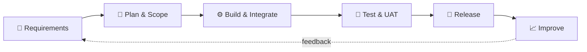

<!-- ===================== ANIMATED HEADER ===================== -->

 

 

---
 
## 👋 About Me
 
> **Building software is easy. Delivering it on time, integrated, and adopted by real users is the hard part. That's the part I enjoy.**
 
As a **Project Manager**, I've navigated the real-world challenges of delivering software: shifting requirements, cross-team dependencies, tight timelines, and integrations that don't behave on paper.
 
- 🏢 I have worked with **SystemOne** and **EMIS**
- ☁️ I have thorough **SaaS product knowledge**, from product lifecycle to multi-tenant delivery
- 🔌 I manage **EMIS integrations** end to end: scoping, coordination, delivery, and go-live
- 💻 I'm also a **hands-on senior engineer**, so I speak both business and code
---
 
## 🎯 What I Bring
 
<table>
<tr>
<td width="50%" valign="top">
### 📋 Project & Product Management
- SaaS product delivery & roadmap ownership
- Stakeholder & client communication
- Agile / Scrum delivery
- Risk, scope & timeline management
- Cross-functional team leadership
</td>
<td width="50%" valign="top">
### 🔗 Integrations & Healthcare Systems
- **EMIS** integration management
- **SystemOne** platform experience
- API-driven integrations
- Requirements → technical specs
- UAT, release & go-live coordination
</td>
</tr>
</table>
---
 
## 🛠️ Tech Stack
 

**Backend**
 

 
**Frontend**
 

 
**Databases**
 

 
**Tools & Practice**
 

 

---
 
## 🧭 How I Work
 

 
---
 
## 📊 GitHub Stats
 

---
 
## 📌 Featured Work
 
| Project | What it is | Stack |
|---|---|---|
| 🔗 **Project One** | Short description of what it does and the impact | `Laravel` `MySQL` |
| 🖥️ **Project Two** | Short description of what it does and the impact | `React` `Node.js` `MongoDB` |
| ☁️ **Project Three** | Short description of what it does and the impact | `PHP` `REST API` |
 
---
 
## 🤝 Let's Connect
 

 
  
 
*"Good delivery is invisible. The product just works, and the team stays sane."*
 

